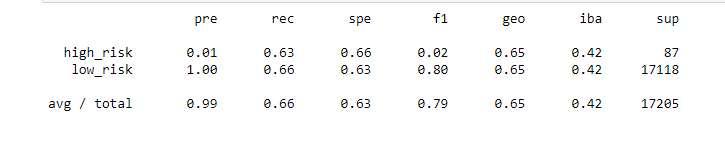
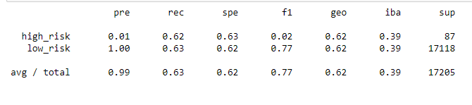
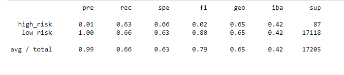
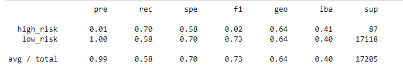
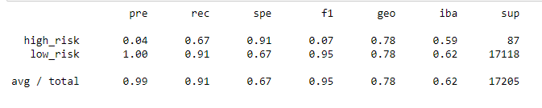
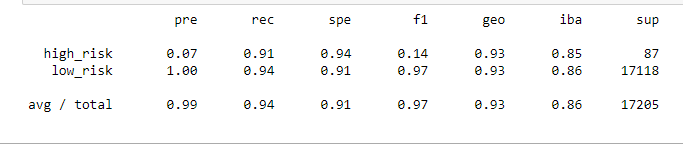

# Credit_Risk_Analysis
## Overview
Using the credit card credit dataset from LendingClub, a peer-to-peer lending services company, we oversampled the data using the RandomOverSampler and SMOTE algorithms, and undersample the data using the ClusterCentroids algorithm. Then, we used a combinatorial approach of over- and undersampling using the SMOTEENN algorithm. Next, we compared two new machine learning models that reduce bias, BalancedRandomForestClassifier and EasyEnsembleClassifier, to predict credit risk. Finally, we evaluated the performance of these models and make a written recommendation on whether they should be used to predict credit risk.

## Results

### To Begin we ran a Naive Random Oversampling of the data

* Balance accuracy score = 0.6484905987244723
* The percison is very low (0.01) for high risk loans and very high (1.0) for low risk loans
* Recall for high risk loans is 0.63 and low risk loans is 0.66

### Aftwerwards we moved on to a SMOTE Oversampling Method

* Balance accuracy score = 0.623523937295285
* The percison is very low (0.01) for high risk loans and very high (1.0) for low risk loans
* Recall for high risk loans is 0.62 and low risk loans is 0.63 

### The next step was to run an Undersmapling of the data

* Balance accuracy score = 0.623523937295285
* The percison is very low (0.01) for high risk loans and very high (1.0) for low risk loans
* Recall for high risk loans is 0.63 and low risk loans is 0.66

### After running both an over and an under sampling we decide to run a Combination Over-under Sampling

* Balance accuracy score = 0.6398024261616125
* The percison is very low (0.01) for high risk loans and very high (1.0) for low risk loans
* Recall for high risk loans is 0.70 and low risk loans is 0.58

### Moving forward we decided to use a Balanced Random Forest Classifier

* Balance accuracy score = 0.7877672625306695
* The percison is very low (0.04) for high risk loans and very high (1.0) for low risk loans
* Recall for high risk loans is 0.67 and low risk loans is 0.91

### Fianlly, the last test we ran was an Easy Ensamble AdaBoost Classifier

* Balance accuracy score = 0.925427358175101
* The percison is very low (0.07) for high risk loans and very high (1.0) for low risk loans
* Recall for high risk loans is 0.91 and low risk loans is 0.94

## Summary
After running multiple anaalyses, we can see that each module learned differently and produced different accuracy, percision, and recall scores. The model with the best scores, and the one we recommend using, is the Easy Ensmable AdaBoost Classifier. We wnat a model that will perform the most accurately and the AdaBoost had the highest overall accuracy of 0.925 (rounded). 
